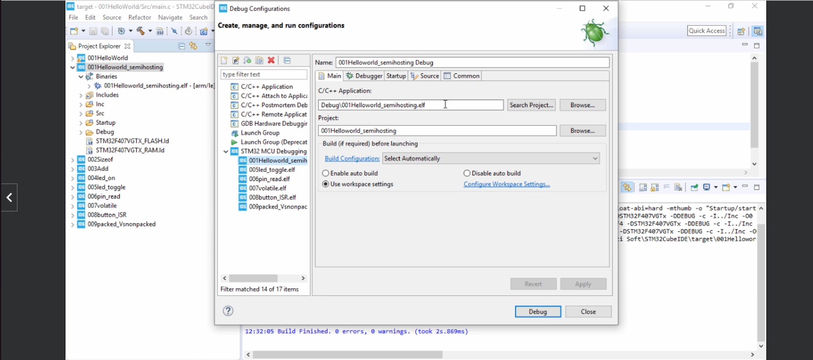

# Embedded-C-STM32

## Open OCD semihosting configuration


###Set the linker arguments 
```
-specs=rdimon.specs -lc -lrdimon
```

###Add semi-hosting run command
```
monitor arm semihosting enable 
```

###Add the below function call to main.c 
```
extern void initialise_monitor_handles(void);
initialise_monitor_handles();
```
